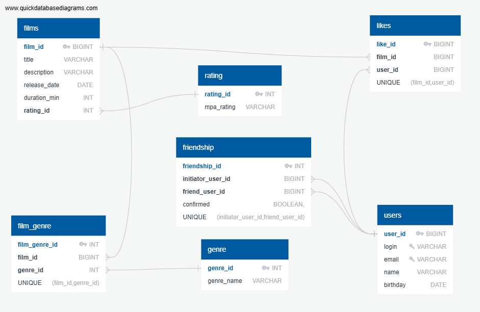

# java-filmorate

## Описание проекта

Представьте, что после изучения сложной темы и успешного выполнения всех заданий вы решили отдохнуть и провести вечер за просмотром фильма. Вкусная еда уже готовится, любимый плед и уютное кресло ждут вас — а вы всё ещё не выбрали, что же посмотреть! Фильмов много — и с каждым годом становится всё больше. Чем их больше, тем больше разных оценок. Чем больше оценок, тем сложнее сделать выбор. Однако не время сдаваться! Данный сервис будет работать с фильмами и оценками пользователей, а также возвращать топ-5 фильмов, рекомендованных к просмотру. Теперь ни вам, ни вашим друзьям не придётся долго размышлять, что посмотреть вечером.

## Структура базы данных

БД состоит из следующих основных компонентов:

- **films**: таблица фильмов
- **genre**: таблица жанров фильмов
- **film_genre**: связующая таблица фильм-жанры
- **users**: таблица пользователей
- **friendship**: таблица связей дружбы
- **likes**: таблица лайков пользователей к фильмам
- **rating**: таблица рейтинга МРА

## Диаграмма базы данных



## Примеры SQL-запросов для основных операций приложения Filmorate

## Ниже приведены примеры SQL-запросов, демонстрирующих взаимодействие с базой данных проекта Filmorate.

## 1. Получение списка всех фильмов

```sql
SELECT f.title,
       f.description,
       f.release_date,
       f.duration_min,
       r.mpa_rating
FROM films AS f
INNER JOIN rating AS r ON f.rating_id = r.rating_id
ORDER BY f.title;
```

## 2. Добавление нового фильма

```sql
INSERT INTO films (title, description, release_date, duration_min, rating_id)
VALUES ('Новый фильм', 'Описание нового фильма.', '2025-01-01', 120, 3);
```

## 3. Обновление описания существующего фильма

```sql
UPDATE films SET description = 'Обновленное описание' WHERE film_id = 1;
```

## 4. Удаление фильма

```sql
DELETE FROM films WHERE film_id = 1;
```

## 5. Поиск фильмов определенного жанра

```sql
SELECT f.title,
       g.genre_name
FROM films AS f
INNER JOIN film_genre AS fg ON f.film_id = fg.film_id
INNER JOIN genre AS g ON fg.genre_id = g.genre_id
WHERE g.genre_name = 'Комедия';
```

## 6. Подсчет количества друзей конкретного пользователя

```sql
SELECT COUNT(*) AS friend_count
FROM friendship
WHERE (initiator_user_id = 1 OR friend_user_id = 1);
```

## 7. Выборка всех пользователей, которым понравился определенный фильм

```sql
SELECT u.name
FROM likes AS l
INNER JOIN users AS u ON l.user_id = u.user_id
WHERE l.film_id = 1;
```

### 8. Список рекомендаций фильмов пользователям, основываясь на предпочтениях друзей

```sql
SELECT f.film_id,
       f.title,
       f.description,
       f.release_date,
       f.duration_min,
       f.rating_id,
       r.mpa_rating
FROM films f
LEFT JOIN likes l ON f.film_id = l.film_id
LEFT JOIN rating r ON f.rating_id = r.rating_id
GROUP BY f.film_id, f.title, f.description, f.release_date, f.duration_min, f.rating_id, r.mpa_rating
ORDER BY COUNT(l.user_id) DESC, f.film_id ASC
LIMIT ?
```