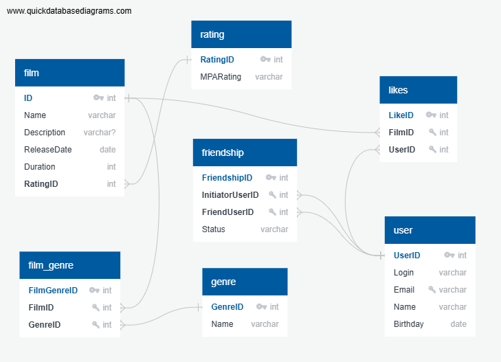

# java-filmorate

## Описание проекта

Представьте, что после изучения сложной темы и успешного выполнения всех заданий вы решили отдохнуть и провести вечер за просмотром фильма. Вкусная еда уже готовится, любимый плед и уютное кресло ждут вас — а вы всё ещё не выбрали, что же посмотреть! Фильмов много — и с каждым годом становится всё больше. Чем их больше, тем больше разных оценок. Чем больше оценок, тем сложнее сделать выбор. Однако не время сдаваться! Данный сервис будет работать с фильмами и оценками пользователей, а также возвращать топ-5 фильмов, рекомендованных к просмотру. Теперь ни вам, ни вашим друзьям не придётся долго размышлять, что посмотреть вечером.

## Структура базы данных

БД состоит из следующих основных компонентов:

- **film**: таблица фильмов
- **genre**: таблица жанров фильмов
- **film_genre**: связующая таблица фильм-жанры
- **user**: таблица пользователей
- **friendship**: таблица связей дружбы
- **likes**: таблица лайков пользователей к фильмам

## Диаграмма базы данных

## Примеры SQL-запросов для основных операций приложения Filmorate

## Ниже приведены примеры SQL-запросов, демонстрирующих взаимодействие с базой данных проекта Filmorate.

## 1. Получение списка всех фильмов (SELECT)

SELECT *
FROM film
ORDER BY name;

## 2. Добавление нового фильма (INSERT INTO)

INSERT INTO film (name, description, release_date, duration, mpaarating)
VALUES ('Новый фильм', 'Описание нового фильма.', '2025-01-01', 120, 'PG-13');

## 3. Обновление описания существующего фильма (UPDATE)

UPDATE film SET description = 'Обновленное описание' WHERE id = 1;

## 4. Удаление фильма (DELETE)

DELETE FROM film WHERE id = 1;

## 5. Поиск фильмов определенного жанра (JOIN)

SELECT f.name AS film_name,
       g.name AS genre_name
FROM film AS f
INNER JOIN film_genre AS fg ON f.id = fg.film_id
INNER JOIN genre AS g ON fg.genre_id = g.id
WHERE genre_name = 'Комедия';

## 6. Подсчет количества друзей конкретного пользователя (COUNT)

SELECT COUNT(*) AS friend_count
FROM friendship
WHERE (initiator_user_id = 1 OR friend_user_id = 1) AND status = 'CONFIRMED';

## 7. Выборка всех пользователей, которым понравился определенный фильм (LIKE)

SELECT u.name
FROM likes AS l
INNER JOIN user AS u ON l.user_id = u.id
WHERE l.film_id = 1;

## 8. Список рекомендаций фильмов пользователям, основываясь на предпочтениях друзей (GROUP BY, HAVING)

WITH friends_likes AS (
SELECT fl.film_id, COUNT(*) AS like_count
FROM friendship AS fr
INNER JOIN likes fl ON fr.friend_user_id = fl.user_id
WHERE (initiator_user_id = 1 OR friend_user_id = 1) AND status = 'CONFIRMED';
GROUP BY fl.film_id
HAVING COUNT(*) > 1
)
SELECT f.name, COUNT(fl.like_count) AS recommendation_score
FROM friends_likes AS fl
INNER JOIN film f ON fl.film_id = f.id
GROUP BY f.name
ORDER BY recommendation_score DESC LIMIT 5;